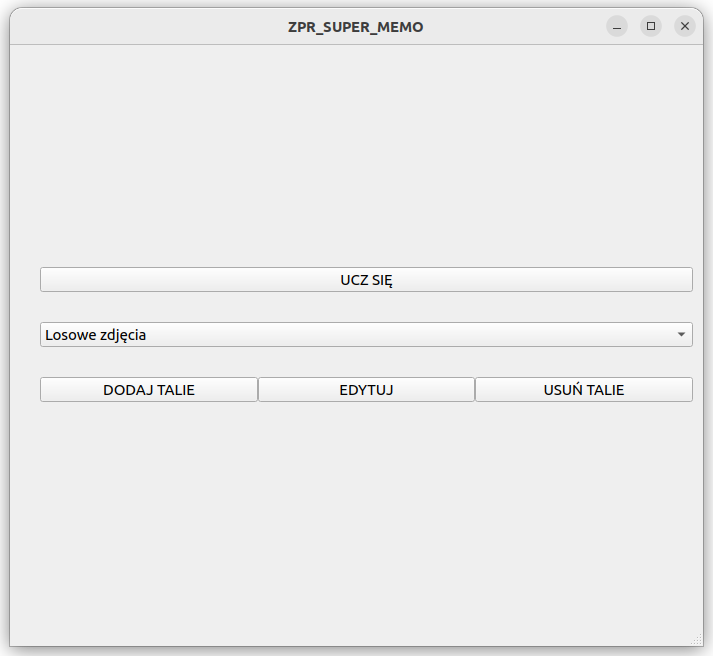
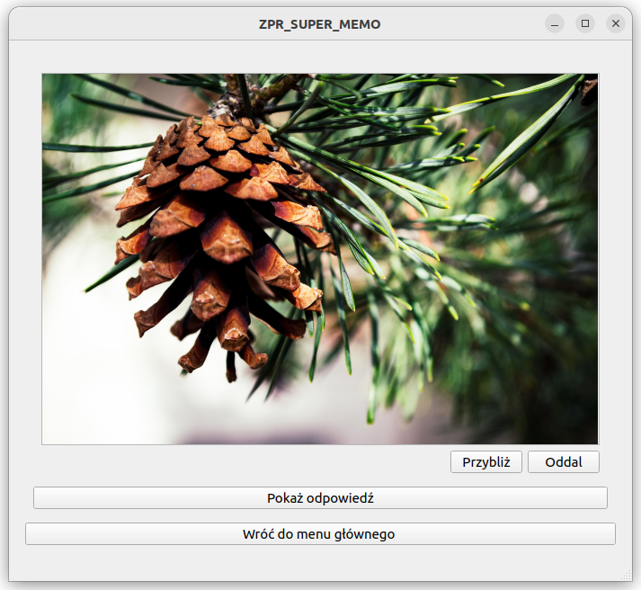

# Flashcard application using spaced repetition SM-2 method

Authors: [Maciej Groszyk](https://github.com/MaciejGroszyk), [Mateusz Zembroń](https://github.com/mzembron)

## Introduction
This project is a simple flashcard application that helps you learn anything using [spaced repetition method](https://en.wikipedia.org/wiki/Spaced_repetition), which will allow you to do it noticeably faster. Flashcards can contain text, images, or sound (there is an easy way to add new ones through the application). The implemented algorithm calculates new repetition dates according to the [SuperMemo-2 method](https://en.wikipedia.org/wiki/SuperMemo#Description_of_SM-2_algorithm). 

  

  

## Requirements
- Qt5 `sudo apt install -y qtbase5-dev qt5-qmake cmake`
- Qt5 multimedia: `sudo apt-get build-dep qtmultimedia5-dev`
- gtest (autmoaticly downloaded by cmake script)

    Useful command :

    `sudo apt-get install build-essential`

## Running applicaion

Compile project using following commands (in project directory):
    
 `cmake CMakeLists.txt`

 `make`

Now u can run applicaiton:

 `./spaced_repetition`

